<p align="center">
  <a href="https://shellcanvas.com">
    <picture>
      <source media="(prefers-color-scheme: dark)" srcset="docs/assets/readme/banner-dark.webp">
      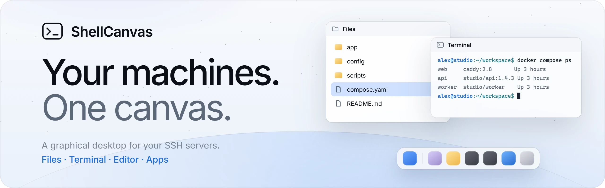
    </picture>
  </a>
</p>

<p align="center">
  <b>Turn the servers you reach over SSH into a real desktop.</b><br>
  Files, terminals, an editor and apps, in windows you arrange, running on your computer.<br>
  Nothing to install on the server.
</p>

<p align="center">
  <a href="https://github.com/techartdev/ShellCanvas/releases/latest"><picture><source media="(prefers-color-scheme: dark)" srcset="docs/assets/readme/button-download-dark.png">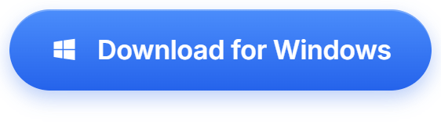</picture></a>
  <a href="https://shellcanvas.com"><picture><source media="(prefers-color-scheme: dark)" srcset="docs/assets/readme/button-website-dark.png">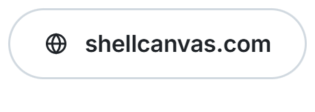</picture></a>
  <a href="https://shellcanvas.com/docs/"><picture><source media="(prefers-color-scheme: dark)" srcset="docs/assets/readme/button-docs-dark.png">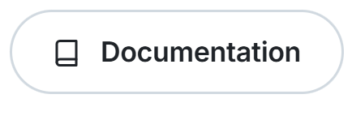</picture></a>
</p>

<p align="center">
  <a href="https://github.com/techartdev/ShellCanvas/releases/latest"></a>
  
  <a href="LICENSE"></a>
  
</p>

<br>

<picture>
  <source media="(prefers-color-scheme: dark)" srcset="docs/assets/readme/hero-dark.webp">
  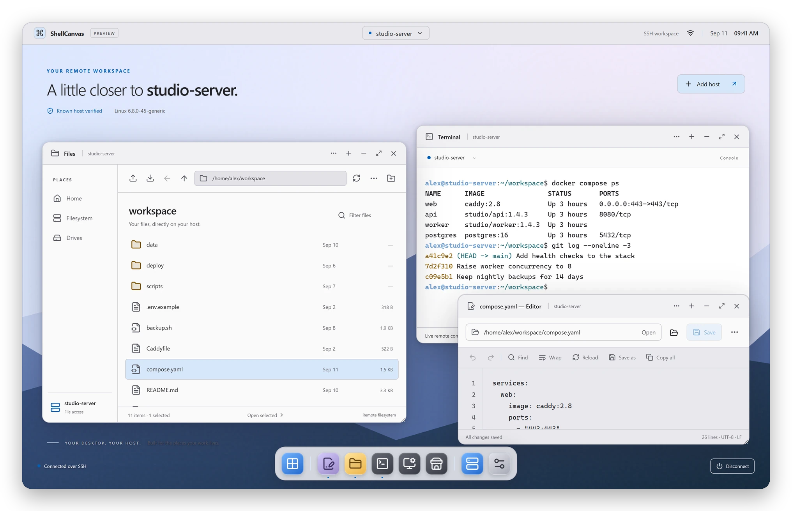
</picture>

<p align="center"><sub>Files, Terminal and the editor on one connected server. Screenshots use sample hosts and data.</sub></p>

> [!NOTE]
> ShellCanvas is a **public preview** for Windows. The app launcher, App Manager and the refreshed Canvas theme shown on this page are on `main` and ship in the next release; [0.1.1](https://github.com/techartdev/ShellCanvas/releases/tag/v0.1.1) has the earlier Apps window and theme. See [where things stand](#where-things-stand).

## Why ShellCanvas

SSH gives you a shell. ShellCanvas gives you the rest of a computer: a file manager that feels local, an editor that saves safely, terminals side by side and apps that know which host they are working on. It all runs on your machine and talks to your server over plain SSH, the connection you already use.

- **A desktop, not a dashboard.** Move, resize, tile and minimize real windows between a top bar and a dock. Open several Files and Terminal windows per host.
- **Nothing to install on the server.** ShellCanvas uses the SSH server your machine already runs, with SFTP for files. No agent, no daemon, only SSH.
- **Trust you can see.** A new host's key is shown for review before you sign in, and a changed key is refused. Passwords and passphrases are never saved.
- **Room to grow.** Install apps straight from GitHub, switch themes, or build your own apps and connection adapters with the public SDKs.

<picture>
  <source media="(prefers-color-scheme: dark)" srcset="docs/assets/readme/how-it-works-dark.webp">
  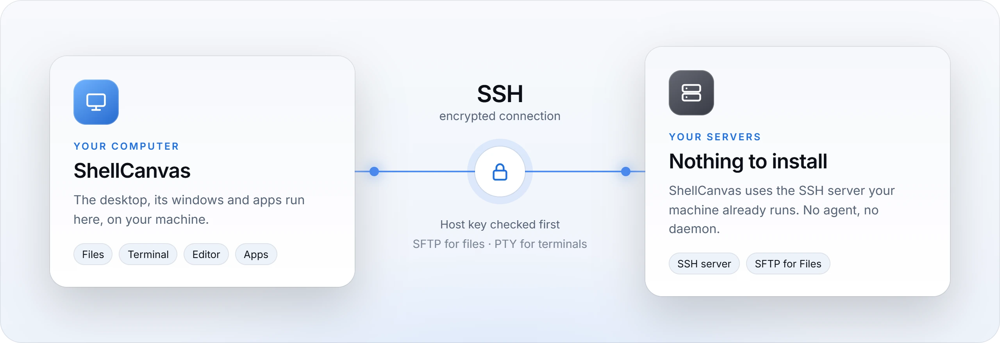
</picture>

## A quick tour

### Files that feel local

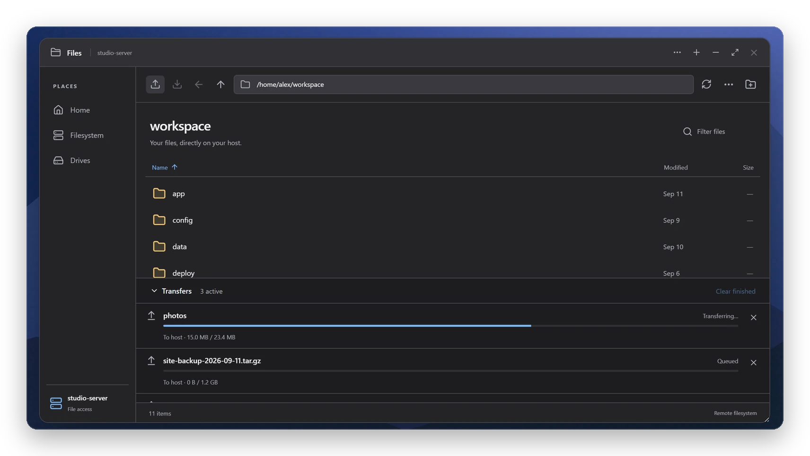

Browse with places, a path bar and a filter. Select many items at once, and reach everyday actions from a context menu with the shortcuts you expect: rename with <kbd>F2</kbd>, cut and paste between Files windows with <kbd>Ctrl</kbd>+<kbd>X</kbd> and <kbd>Ctrl</kbd>+<kbd>V</kbd>, move or copy to another folder, delete. Upload and download files or whole folders through a queue that shows progress and can be cancelled. ShellCanvas never overwrites something that already exists.

On Windows, copy files and folders from ShellCanvas and paste them into File Explorer, or the other way round.

### Terminal and editor, side by side

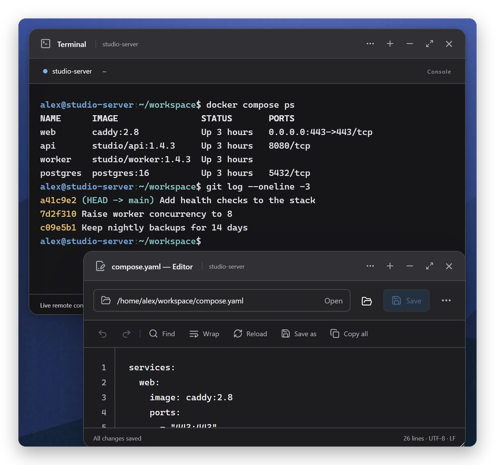

Terminals are real shells over SSH. Open several at once, each with its own session, a right-click menu, and <kbd>Ctrl</kbd>+<kbd>Shift</kbd>+<kbd>C</kbd> / <kbd>V</kbd> for the clipboard while <kbd>Ctrl</kbd>+<kbd>C</kbd> still interrupts.

The editor opens UTF-8 text files up to 256 KiB, with find, undo, word wrap and Save As. Before it saves, ShellCanvas checks that nobody changed the file on the server in the meantime, then replaces it atomically on servers that support it, such as OpenSSH.

### Every host gets its own space

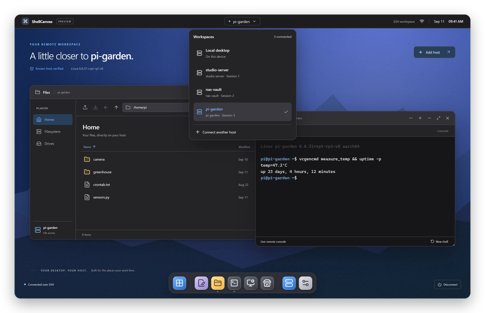

Connect to several machines at once and switch between them from the top bar. Each workspace keeps its own windows, folders and terminal output. If a connection drops, reconnect in place: your windows, folders and unsaved drafts are still there, and terminals start fresh shells.

### Connect with confidence

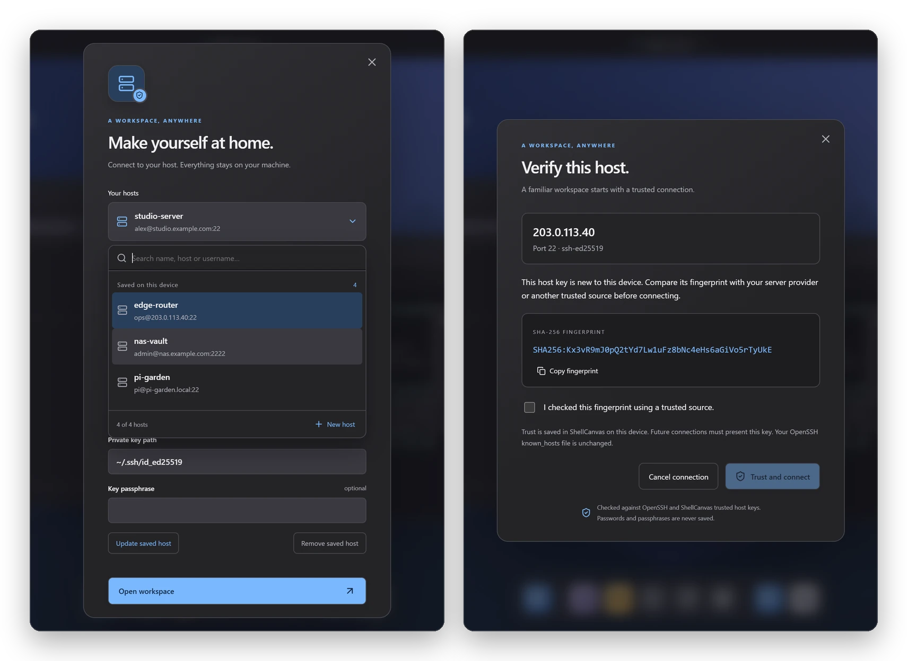

Pick a saved host or import one from `~/.ssh/config`, then sign in with a key or a password. Host keys are checked against your OpenSSH `known_hosts` and ShellCanvas's own trust store before authentication. A new server shows its fingerprint for you to confirm, and a server whose key changed is blocked.

### Apps, whenever you want them

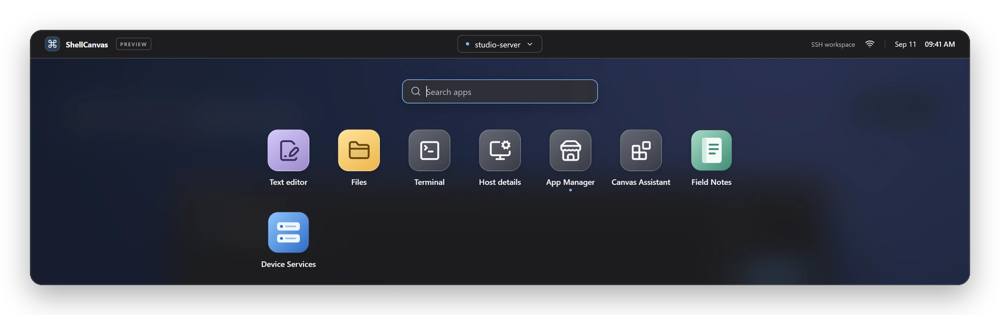

Open everything from the launcher, and add more with App Manager. Install from a public GitHub repository or a package file, review exactly what each app may access, and check for updates later. On Windows, installed apps run in an isolated frame and get only the access you approve.

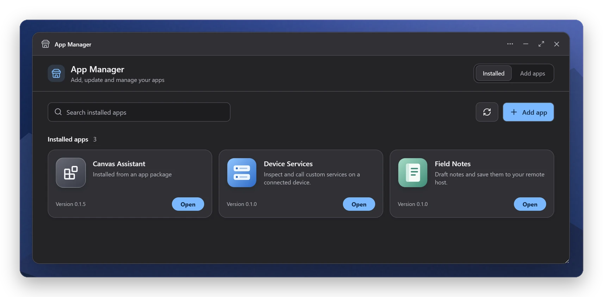

Want an assistant on the desktop? [Canvas Assistant](https://github.com/techartdev/ShellCanvas-Assistant) is an optional app that talks to an OpenAI-compatible model you configure. It can look through files in your workspace, and every file change or terminal command it proposes waits for your approval.

### Make it yours

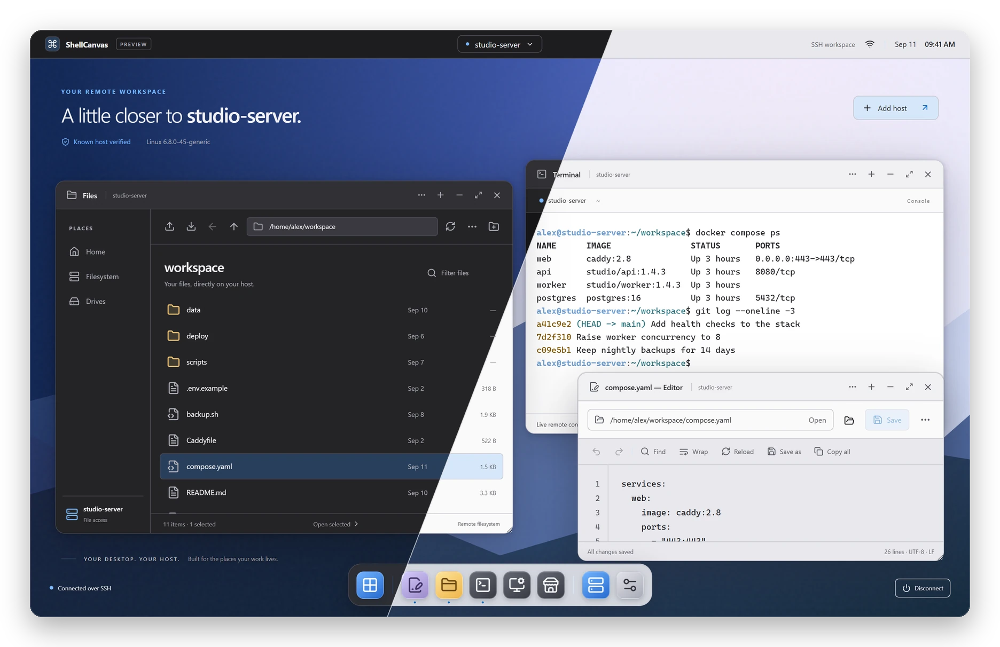

Canvas, the built-in theme, comes in light and dark and can follow your system. Choose a wallpaper or use your own photo, scale the interface from 80 to 150 percent and size the dock to taste. Themes are plain data files you can install from disk or GitHub, so anyone can make one; start from [Canvas Study](examples/themes/canvas-study).

## Get started

1. **Download** the latest [release](https://github.com/techartdev/ShellCanvas/releases/latest): the `.exe` setup installs for your user account, or use the `.msi` package. Preview builds are not code-signed yet, so Windows may warn about an unknown publisher. Each release lists SHA-256 checksums in `SHA256SUMS.txt`.
2. **Add a host.** Enter its address, your user name and a private key or password, or choose an entry from `~/.ssh/config`.
3. **Verify and connect.** Compare the fingerprint, confirm it, and your workspace opens with Files and a terminal.

**You need** Windows (x64) with the Microsoft Edge WebView2 runtime, which Windows 11 includes, and a server running SSH. Files, the editor and transfers also need SFTP, which OpenSSH provides.

## Where things stand

ShellCanvas is young and says so. Support claims come from tests on real systems, and this table lists only what has been checked.

| Area | Status |
| --- | --- |
| **Windows client** | Released as NSIS and MSI installers (x64, not yet code-signed). |
| **macOS client** | Builds from source. Launch, layout and Settings are confirmed on an Intel Mac running Catalina; SSH workflows on the Mac client are not validated yet. |
| **Linux client** | Not validated yet. |
| **Linux servers** | Files, terminal, editing and transfers are verified on an Ubuntu test server. Other distributions use the same SSH and SFTP path but have not been tested. |
| **macOS servers** | Browsing files and a live shell are confirmed; writes and transfers are not validated yet. |
| **Windows OpenSSH servers** | Not validated yet. |

Also on the way: signed installers, validated macOS and Linux clients, and [Drive Bridge](https://github.com/techartdev/ShellCanvas-DriveBridge), a separate free app in preview that attaches a remote folder as a local drive. The connection model is ready for more than SSH (for example serial, Telnet, FTP or a device API per workspace), but those adapters are not built yet. See the [roadmap](ROADMAP.md).

## Build for ShellCanvas

**Apps.** The [app SDK](docs/app-sdk.md) generates a project, type-checks it and builds a single installable package. No desktop rebuild or restart is needed.

```sh
npx --package @techartdev/shellcanvas-app-sdk shellcanvas-app init my-notes --id org.example.notes --title "My Notes"
cd my-notes
npm install
npm run build   # writes dist/app.shellcanvas.json
```

In App Manager, choose **Add apps → Choose package…** and pick the result. To share it, run `npx shellcanvas-app repository . --description "What it does"` and commit the generated `shellcanvas.repo.json` so others can install it from GitHub.

**Connection adapters.** The Rust [`shellcanvas-adapter-sdk`](https://docs.rs/shellcanvas-adapter-sdk) and its `shellcanvas-adapter` CLI create, build and validate native adapters that add file, console, settings or custom services to a workspace. See the [adapter SDK guide](docs/adapter-sdk.md) and the [filesystem SDK](crates/filesystem-sdk).

Both SDKs are at 0.1 and still provisional. The repository's [AI development skills](docs/ai-development-skills.md) help coding agents build apps and adapters against them.

## Build from source

You need Node.js 22+, Rust 1.93+ and the [Tauri prerequisites](https://v2.tauri.app/start/prerequisites/) for your platform.

```sh
npm ci
npm run desktop           # run the desktop app with live reload
npm run dev               # browser design preview with sample data, no SSH
npm run verify            # formatting, tests and lint; add -- --native to also build the app
npm run release:windows   # NSIS and MSI installers
```

The [engineering documentation](docs/README.md) covers the architecture, contracts and verification records.

## Contributing

Bug reports, compatibility reports from new systems and focused pull requests are all welcome. Start with the [contributing guide](CONTRIBUTING.md). Report security issues privately as described in the [security policy](SECURITY.md), and follow the [code of conduct](CODE_OF_CONDUCT.md). Changes are tracked in the [changelog](CHANGELOG.md).

## License

ShellCanvas is licensed under the [Mozilla Public License 2.0](LICENSE). Modified MPL-covered files stay under the MPL when distributed; separate apps, themes and adapters may use their own licenses.

<br>

<p align="center">
  <sub>Made with Tauri, Rust and React · <a href="https://shellcanvas.com">shellcanvas.com</a></sub>
</p>
